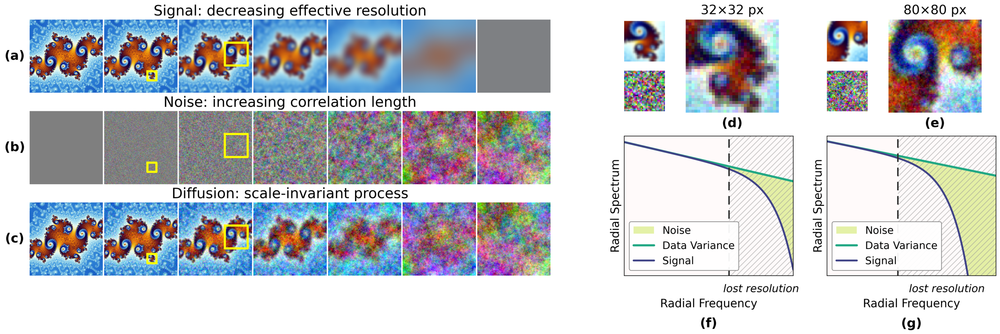
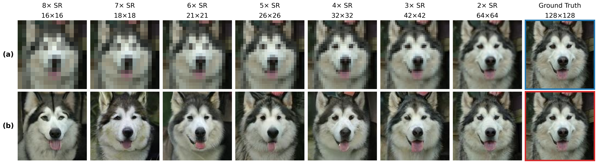
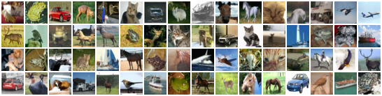
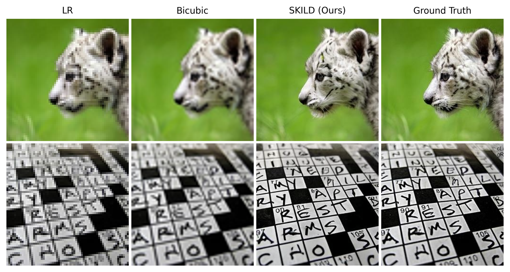
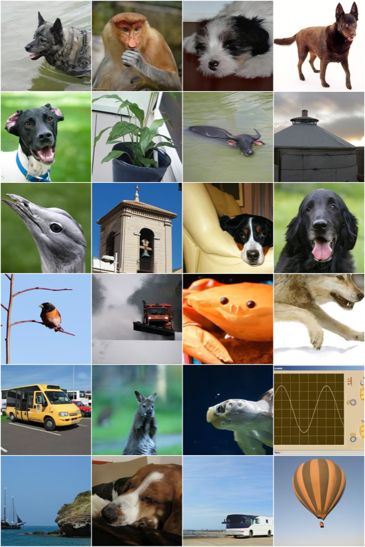
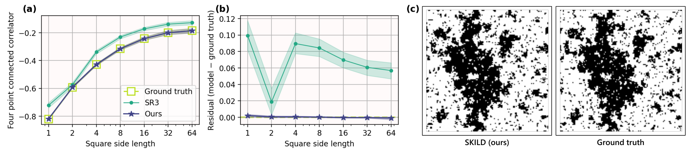

# SKILD &mdash; Scale-Invariant K-Space Image Learning Diffusion

Official code repository for the paper ***Everything at Every Scale: Scale-Invariant Diffusion with Continuous Super-Resolution***.

## Overview

SKILD is a **single unconditional diffusion model** that performs both unconditional generation and continuous super-resolution from one trained network &mdash; with **no task-specific architecture, no conditioning branch, no classifier-free guidance, and no retraining per scale factor**.

The key idea is to make scale an explicit coordinate of the diffusion process. The forward chain attenuates image content from fine to coarse scales in k-space while injecting **spectrum-matched** Gaussian noise; the reverse chain is a unified estimator that can be initialized either from pure noise (generation) or from any intermediate scale (super-resolution).

<p align="center">
  
</p>

<p align="center">
  <sub>
    <b>Concept.</b> Conceptual illustration of SKILD on a self-similar
    fractal image. During the forward process, (a) the effective signal
    resolution decreases while (b) the pixel-space correlation length of
    the injected noise increases; (c) for a self-similar field the chain
    preserves the same frequency-space power spectrum across stages.
    (d&ndash;e) A smaller early-time patch is statistically similar to a
    larger late-time patch. (f&ndash;g) Radial power spectra at the
    corresponding early and late stages; gray slashed regions mark modes
    below the signal-to-noise-ratio threshold where resolution is
    effectively lost.
  </sub>
</p>

## Highlights

- **One model, two tasks.** The same trained reverse process performs unconditional generation and continuous super-resolution by varying only the starting timestep.
- **CIFAR-10 (unconditional generation):** FID **2.65** / IS **9.63**.
- **ImageNet-256 4&times; super-resolution:** best LPIPS / CLIPIQA / MUSIQ and second-best SSIM among compared conditional baselines &mdash; from a single unconditional checkpoint with no conditioning, no classifier-free guidance, and no class labels.
- **Continuous SR (qualitative).** A single ImageNet-128 checkpoint reconstructs a continuum of 2&times;&ndash;8&times; factors by varying only the reverse starting timestep.
- **Statistical physics.** Reconstructs critical 2D Ising configurations whose connected four-point correlations closely track the ground truth.

### Continuous super-resolution from a single checkpoint

<p align="center">
  
</p>

<p align="center">
  <sub>
    <b>Continuous super-resolution on ImageNet-128.</b>
    <i>(a)</i> Low-resolution inputs at effective resolutions
    16&times;16 through 64&times;64, corresponding to 8&times; through
    2&times; super-resolution factors. <i>(b)</i> High-resolution
    reconstructions produced by the <b>same trained checkpoint</b> from
    each effective-resolution starting state &mdash; a continuum of
    super-resolution factors is accessible from a single trained model.
  </sub>
</p>

### Unconditional generation on CIFAR-10

<p align="center">
  
</p>

<p align="center">
  <sub>
    <b>Uncurated CIFAR-10 samples.</b> Drawn from pure noise by the
    SKILD reverse process with the linear schedule (paper Table 1 model,
    FID 2.65 / IS 9.63).
  </sub>
</p>

### 4&times; super-resolution on ImageNet-256

<p align="center">
  
</p>

<p align="center">
  <sub>
    <b>4&times; super-resolution samples on ImageNet-256.</b> The model
    is initialized from a 64&times;64 low-resolution forward state and
    reconstructs high-frequency details through the reverse process &mdash;
    no conditioning, no class labels, no classifier-free guidance
    (paper Table 4 model).
  </sub>
</p>

<p align="center">
  
</p>

<p align="center">
  <sub>
    <b>Additional 4&times; super-resolution samples on ImageNet-256</b>
    (paper appendix), produced by the same unconditional checkpoint
    under the same 64&times;64 &rarr; 256&times;256 protocol.
  </sub>
</p>

### Scientific benchmark: critical 2D Ising model

Critical physical systems let us go beyond perceptual realism and ask a
stricter question: can the model reconstruct missing fine scales while
preserving the observables that define the scale-invariant law? We test
SKILD on the prototypical two-dimensional Ising model at its critical
temperature, where the distribution becomes statistically self-similar
under renormalization-group coarse-graining. We super-resolve from a
32&times;32 effective-resolution starting state up to a 128&times;128
critical-Ising field and evaluate the **connected four-point
correlator** over the corners of square patches at multiple side lengths
&mdash; an observable that subtracts all pairwise contributions and so
isolates higher-order, scale-invariant structure that cannot be inferred
from pixel-level distortion alone.

<p align="center">
  
</p>

<p align="center">
  <sub>
    <b>Critical 2D Ising four-point benchmark.</b>
    <i>(a&ndash;b)</i> Benchmark of four-point correlator accuracy:
    SKILD's reconstruction closely tracks the ground truth across patch
    sizes, while SR3 &mdash; a strong conditional diffusion-based
    super-resolution baseline &mdash; shows a clear deviation.
    <i>(c)</i> A SKILD-reconstructed critical Ising field sample
    compared to the ground truth.
  </sub>
</p>

## Repository layout

```
.
├── diffusion.py            # SKILD forward / reverse process, losses, samplers
├── train.py                # Distributed training (generation + GT-init SR preview)
├── sample.py               # Unconditional sampling: full | viz modes
├── evaluate.py             # FID / IS via torch-fidelity
├── sr_eval.py              # Paired SR evaluation from GT forward marginals
│                           # (PSNR / SSIM / LPIPS / MUSIQ / CLIPIQA)
├── datasets.py             # ImageFolder / CIFAR-10 loaders + transforms
├── schedule_sampler.py     # Timestep samplers (uniform, loss-aware)
├── utils.py                # DCT, k-grid, power-law PSD, logging helpers
├── configs/
│   ├── cifar10_defaults.py
│   ├── imagenet128_defaults.py
│   ├── imagenet256_defaults.py
│   └── specifics/
│       ├── cifar10_linear.py
│       ├── cifar10_log_linear.py
│       ├── imagenet128_4x.py        #  32 -> 128
│       ├── imagenet128_8x.py        #  16 -> 128
│       ├── imagenet256_4x.py        #  64 -> 256
│       └── ising128_4x.py
├── models/
│   ├── mutils.py           # Model construction, EMA, optimizer
│   └── ncsnpp/             # NCSN++ score backbone (Song et al. 2021)
├── spectrum/
│   ├── spectrum.py         # Dataset PSD measurement + power-law fit
│   └── *_var.npy           # Precomputed dataset spectra
├── data_generation/
│   └── ising_wolff.py      # Critical 2D Ising sample generator
├── environment.yml
├── LICENSE
└── README.md
```

## Installation

```bash
git clone https://github.com/<org>/skild.git
cd skild
conda env create -f environment.yml
conda activate skild

# Install PyTorch built for your CUDA version, e.g.:
pip install torch==2.7.1 torchvision==0.22.1 torchaudio==2.7.1 \
    --index-url https://download.pytorch.org/whl/cu128
```

Tested with PyTorch 2.7 / CUDA 12.8 / Python 3.12 on NVIDIA H100 and A100 GPUs.

## Data

| Config                 | Dataset                              | Where to obtain                                                                                                       |
| ---------------------- | ------------------------------------ | --------------------------------------------------------------------------------------------------------------------- |
| `cifar10_*`            | CIFAR-10                             | Downloaded automatically via `torchvision`.                                                                           |
| `imagenet{128,256}_*`  | ImageNet-1k                          | Pre-resize / center-crop with `datasets.center_crop_arr` (see `datasets.py`).                                         |
| `ising128_4x`          | Critical 2D Ising (L = 128)          | Generated with `python -m data_generation.ising_wolff --L 128 ...`.                                                   |

Update the `data.{train,eval,cifar10_root}_path` fields in the matching config before training.

## Training

```bash
torchrun --nproc_per_node=8 train.py \
    --config configs.specifics.cifar10_linear \
    --result_dir results
```

Resume:

```bash
torchrun --nproc_per_node=8 train.py \
    --config configs.specifics.cifar10_linear \
    --resume_from results/000-NCSNpp-S/checkpoints/0500000.pt
```

Each config defines the schedule (`lambda_i`, `lambda_f`, `theta`, `kc`, `lambda_schedule`), the dataset spectrum fit `S_0(k)`, and architecture hyper-parameters; see the table below.

### Schedule cheat sheet

| Config                       | Task                                                       | &lambda; schedule | &lambda;<sub>i</sub> | &lambda;<sub>f</sub> | &theta; | k<sub>c</sub> | &tau; (SNR) |
| ---------------------------- | ---------------------------------------------------------- | ----------------- | -------------------- | -------------------- | ------- | ------------- | ----------- |
| `cifar10_linear`             | CIFAR-10 unconditional (reported)                          | linear            | 137.7294             | 1.57                 | 5.0     | 3             | 1e-4        |
| `cifar10_log_linear`         | CIFAR-10 unconditional (schedule ablation)                 | log-linear        | -3.75                | -2.0                 | &mdash; | 31.2          | 1e-4        |
| `imagenet256_4x` (64 -> 256) | ImageNet-256 4&times; SR (reported)                        | linear            | 1132.9352            | 550.8723             | 9.0     | 0             | 1e-1        |
| `imagenet128_4x` (32 -> 128) | ImageNet-128 continuous-SR figure                          | linear            | 564.2461             | 275.4361             | 9.0     | 0             | 1e-1        |
| `imagenet128_8x` (16 -> 128) | ImageNet-128 continuous-SR figure                          | linear            | 564.2461             | 102.6489             | 5.0     | 0             | 1e-1        |
| `ising128_4x`  (32 -> 128)   | Critical Ising 4&times; SR / four-point correlator         | linear            | 564.2461             | 275.4361             | 9.0     | 0             | 1e-1        |

> The quantitative ImageNet super-resolution numbers in the paper come
> from the `imagenet256_4x` config. The `imagenet128_{4,8}x` configs are
> used only for the qualitative continuous-SR figure on ImageNet-128.

## Sampling

Unconditional generation (used to produce CIFAR-10 FID / IS numbers):

```bash
python sample.py --config configs.specifics.cifar10_linear \
    --ckpt /path/to/ckpt.pt \
    --output_dir results/samples_cifar10 \
    --num_samples 50000 --batch_size 256
```

Visualize the reverse process:

```bash
python sample.py --config configs.specifics.cifar10_linear \
    --ckpt /path/to/ckpt.pt --mode viz \
    --output_dir results/viz_cifar10 --num_samples 4
```

Super-resolution is run through `sr_eval.py` (see below): the reverse chain
is initialized from the **exact forward marginal** of each held-out HR
image at `init_timestep`, exactly as in the paper. Caching the
initialization makes results paired and reproducible across baselines.

## Evaluation

**FID / IS (unconditional):**

```bash
python evaluate.py \
    --samples_dir results/samples_cifar10/samples \
    --cifar10_path /path/to/cifar10_root
```

**Paired SR metrics (PSNR / SSIM / LPIPS / MUSIQ / CLIPIQA)** &mdash; ImageNet-256 4&times; super-resolution from cached ground-truth forward marginals:

```bash
torchrun --nproc_per_node=8 sr_eval.py \
    --config configs.specifics.imagenet256_4x \
    --ckpt /path/to/ckpt.pt \
    --gt_forward_k_path /path/to/forward_cache.pt \
    --gt_hr_dir /path/to/hr_images \
    --output_dir results/imagenet256_4x_eval \
    --num_samples 3000 --batch_size 32
```

The forward cache (`--gt_forward_k_path`) is a `.pt` tensor containing the exact noisy k-space state at `init_timestep` for each held-out HR image; this guarantees that paired baselines see the same noise realization.
